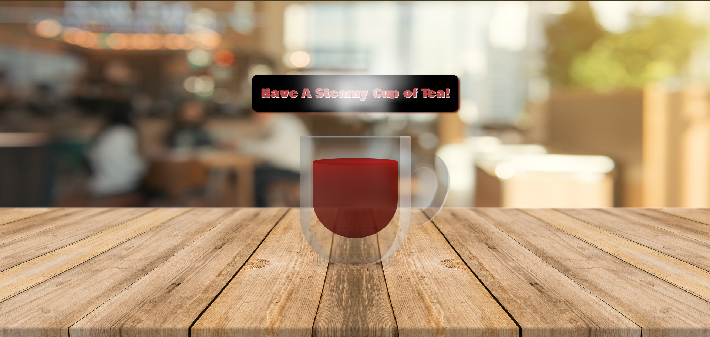

# ☕ Steaming Cup of Tea Animation

<br>

## 🌟 Project Overview

This project demonstrates the power and versatility of CSS animations using custom properties. The centerpiece of this project is an animation of a steaming glass-like cup of Tea, created entirely with pure **HTML** and **CSS**. It highlights how the style="--i:${number}" technique can be used to create dynamic, reusable animations with minimal effort.

<br>

## ✨ Features

- **Glass-like Tea Cup:** 🥛 A transparent Tea cup with - *As close as I can get it to be like* - glass effect, including a handle and shadow.

- **Steaming Animation:** 🌫️ Smooth, natural-looking steam rising dynamically from the cup, controlled using custom properties.

- **Background Design:** 🪵 A wooden tabletop with a blurred cafe-like environment to create depth and atmosphere.

<br>

## 📘 Key Learning Highlights

This project was a practice in mastering:

- CSS custom properties (***variables***) for animations.

- Responsive design using **vw** and **vh** units and **calc()** for scaling.

- Advanced CSS techniques to create realistic visual effects.

- style="--i:${number}" usage to control animation properties dynamically.

<br>

## 🛠️ Code Example

#### HTML Structure

The core of the steaming animation lies in the vapour container and the dynamically styled span elements:

```html
<div class="vapour">
  <span style="--i: 3"></span>
  <span style="--i: 14"></span>
  <span style="--i: 5"></span>
  <!-- More steam elements -->
</div>
```
<br>

#### CSS for Vapour Animation

The --i custom property is used to control animation timing:

```css
.vapour span {
  min-width: 8px;
  height: 120px;
  background-color: rgb(255, 255, 255);
  border-radius: 50%;
  animation: vapourize 7s linear infinite;
  opacity: 0;
  filter: blur(5px);
  animation-delay: calc(var(--i) * -0.5s);
}

@keyframes vapourize {
  0% {
    opacity: 0;
    transform: translateY(0) scaleX(1);
  }
  50% {
    transform: translateY(-50px) scaleX(5);
    opacity: 1;
  }
  95% {
    opacity: 0;
  }
  100% {
    transform: translateY(-150px) scaleX(10);
  }
}
```
<br>

---

<br>

## 🖼️ Screenshot

Here’s a glimpse of the final output:


<br>

## 🎥 Demo

Watch the Animation in Action
<br>


<br>

## 🚀 How to Run the Project

Clone the repository:
```git
git clone https://github.com/nedaagehad/steamy-tea-cup.git
```
Open the index.html file in your browser to view the animation.

<br>

## 💡 Takeaways

This project was a rewarding challenge, pushing the boundaries of what can be achieved with pure CSS. It’s an excellent example of how custom properties can simplify complex animations while keeping the code clean and maintainable.

<br>

## 🙌 Acknowledgments

This project was inspired by [This CSS Animation Tutorial!](https://youtu.be/_jOqYe0eFqY?si=mLpqZZp0ntxNOVzg) ☕
